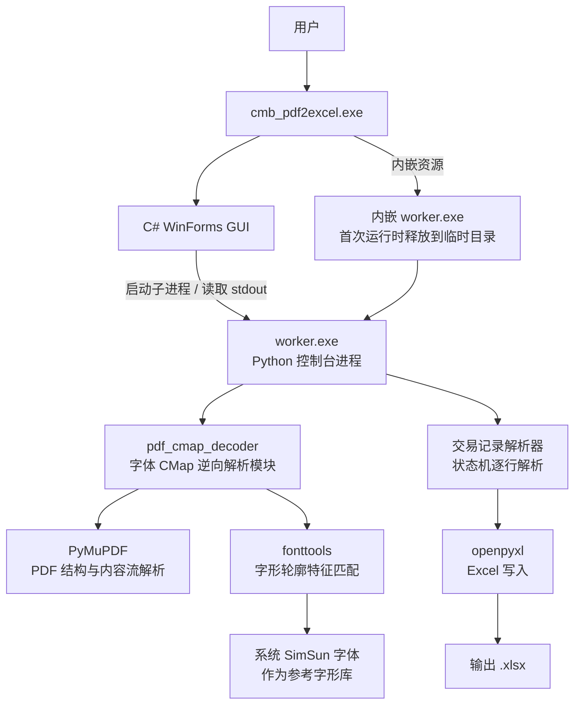

# cmb_pdf2excel

从**招商银行 PDF**（交易流水、信用卡对账单）中提取结构化交易记录，一键导出为 Excel。自动识别文档格式，深度适配招商银行 PDF，实测中文还原率显著优于 tabula。以同一份 60 页招商银行交易流水 PDF（含 1400+ 笔交易）为样本，对比两者的提取效果如下：


| 指标 | 本项目 | tabula | 说明 |
|---|---|---|---|
| 提取记录数 | **1417** | 1411 | 本项目多还原 6 笔交易 |
| 数值字段一致率 | **100%** | **100%** | 日期/金额/余额两者完全一致，互为印证 |
| 还原汉字总数 | **20,177** | 16,995 | tabula 缺失 3,182 字 |
| 中文还原率 | **100%** | **84.2%** | tabula 丢失约 15.8% 的汉字 |
| 导出格式 | **整洁的 Excel 格式** | 混乱的 CSV 格式 | tabula 无法识别断行，产生大量空行，且中文乱码 |


| 字段 | tabula 提取 | 本项目提取 | tabula 丢失的字 |
|---|---|---|---|
| 交易摘要 | `联代付` | `银联代付` | 银 |
| 交易摘要 | `联快捷支付` | `银联快捷支付` | 银 |
| 对手信息 | `基回款` | `基金赎回款` | 金、赎 |
| 交易摘要 | `掌上生活消` | `掌上生活消费` | 费 |
| 对手信息 | `上海壹佰米网络科技有公司` | `上海壹佰米网络科技有限公司` | 限 |
| 对手信息 | `易方基管理有公司` | `易方达基金管理有限公司` | 达、金、限 |


## 功能特性

- 自动逆向解析 PDF 字体编码，正确还原中文
- **自动识别格式**：支持「交易流水」与「信用卡对账单」两类招商银行 PDF
- 交易流水：提取记账日期、币种、交易金额、联机余额、交易摘要、对手信息
- 信用卡账单：提取交易分类、交易日、记账日、交易摘要、人民币金额、卡号末四位，并附账单概览
- 提供命令行版本，便于批量处理与自动化集成
- **纯离线运行**，保障数据隐私


## 使用说明

### 方式一：下载 Release（推荐）

1. 打开仓库的 [Releases 页面](../../releases)
2. 下载最新版本的 `cmb_pdf2excel-<版本>-win-x64.exe`
3. 将这一个 exe 放到任意目录
4. 双击运行（文件名即 `cmb_pdf2excel.exe`）
5. 点击「浏览」选择招商银行交易流水 PDF
6. 输出路径默认自动填充为与 PDF 同名的 `.xlsx`，可手动修改输出路径
7. 点击「开始提取」，完成后点击「打开输出目录」查看结果


### 方式二：从源码构建

| 项目 | 要求 |
|---|---|
| 操作系统 | Windows 10 / 11（64 位） |
| Python | 3.10+ |
| C# 编译器 | 使用 Windows 内置 `.NET Framework` 的 `csc.exe` |


```bash
pip install -r requirements.txt
scripts\build_worker.bat
scripts\build_gui.bat
```

### 方式三：命令行调用

使用 `scripts\build_worker.bat` 构建 worker.exe，即可使用命令行调用：

```bash
worker.exe <PDF路径> <输出xlsx路径>
```

---

## 架构



招商银行导出的交易流水 PDF 使用了 **Identity-H 编码 + 子集化字体**，且嵌入字体的 `cmap` 表被移除、`ToUnicode` CMap 不完整。这导致常规 PDF 文本提取库（pdfplumber、甚至 PyMuPDF 默认方式）只能得到 `(cid:xxxx)` 乱码或错误字符。

本项目通过 `pdf_cmap_decoder` 模块还原真实文本：

1. **解析 PDF 结构**：定位字体对象、`CIDToGIDMap`、不完整的 `ToUnicode` CMap
2. **提取嵌入字体**：读取子集字体的 `glyf` 表（字形轮廓数据）
3. **字形特征匹配**：以 `(轮廓数, xMin, yMin, xMax, yMax)` 为签名，在系统 **SimSun 参考字体** 中检索候选
4. **坐标精确比对**：对歧义候选逐一比较轮廓坐标，唯一确定对应的 Unicode 码位
5. **重建完整映射**：得到 `CID → Unicode` 的完整映射表
6. **解析内容流**：解析 PDF 内容流的 `BT/Tj/TJ` 等操作符，取出原始 CID，应用映射输出正确文本
